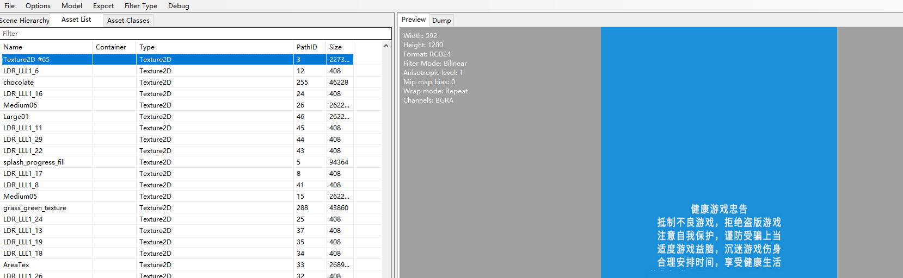
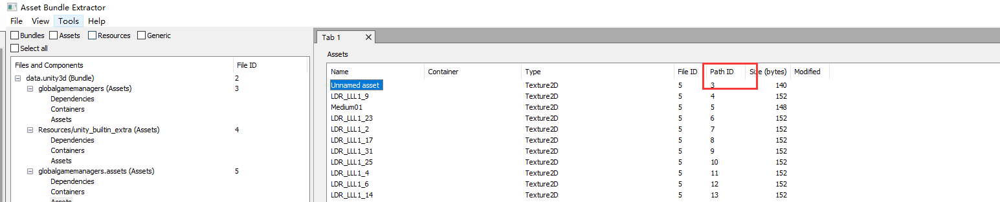
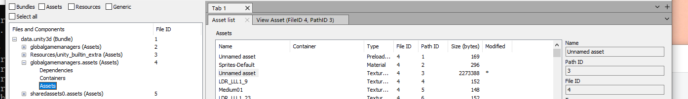

# 替换 unity 资源

1、首先使用工具 AssetStudioGUI.exe 打开 unity.data 查看资源
> https://github.com/Perfare/AssetStudio



2、根据 pathID=3 找到资源，进行修改、替换 Asset bundle Extractor.exe
> https://github.com/SeriousCache/UABE




3、修改之后导出 unity.data 即可


# AS 日志缓存

> 打开配置文件 idea.properties，修改 idea.cycle.buffer.size=20480 并重启即可

写插件的都知道，出现问题时往往需查看日志排查问题，当缓存太小、输出日志过多会造成日志不全，不利于排查问题

# Class 字节码日志

```java
LDC "hello-world"
LDC "CoreManager: hello world"
INVOKESTATIC android/util/Log.d(Ljava/lang/String;Ljava/lang/String;)I
POP
```
